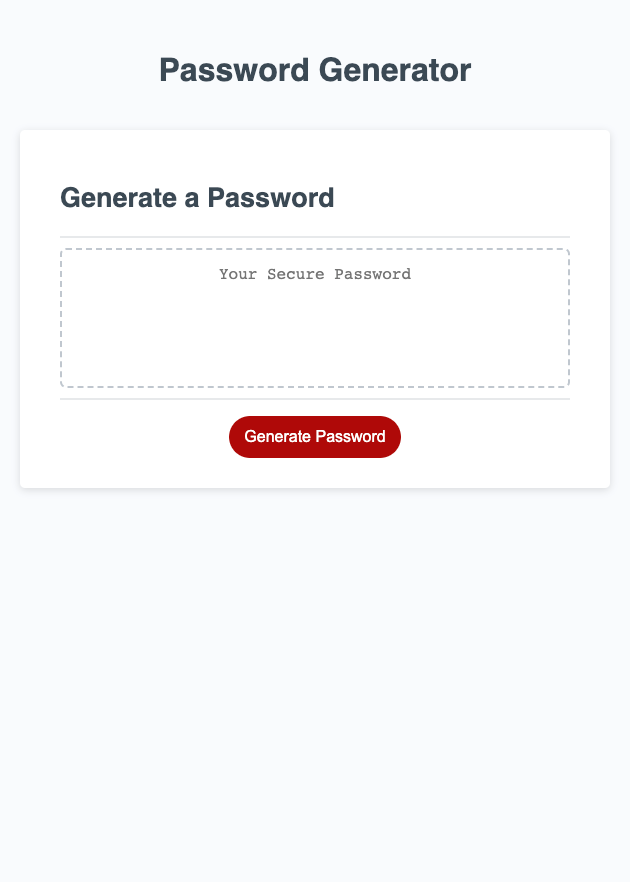

# Password-generator

 Looks like this 

## Purpose

Password-generator is an application that randomly generates secure passwords (8 to 128 characters long) to the user by prompting them through a series of questions about their characters choice (Upper-caes, Lower-cases, Numeric numbers, and Symbols). 
### Installation 

Launch on your default browser

#### Built with 

*HTML
*CSS 
*JS

##### Deployment

https://youssefkaroui.github.io/Password-generator/

## Contribution

Made by Youssef.K

